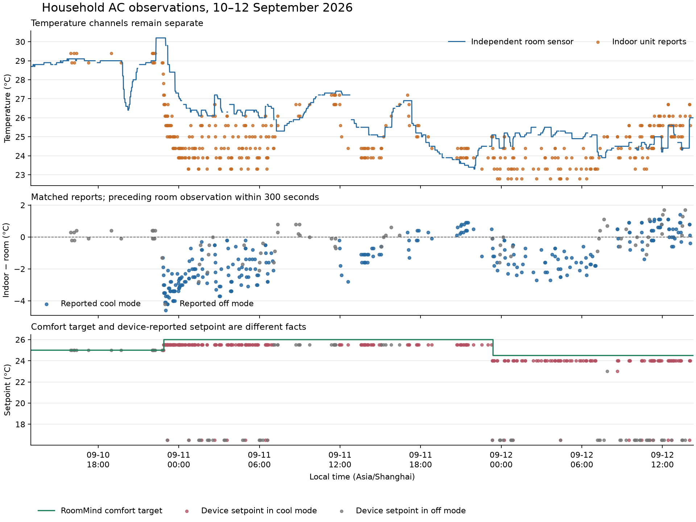

# Household AC Analysis / 家庭空调实测分析

本轮读取了本地三间房的 56,514 条 RoomMind 历史记录，并通过 SSH 只读查询 Home Assistant Recorder 与原始观测库。核心发现是：卧室内机与独立室温之间存在随运行状态变化的温差，而已安装的 `tcl_udp_ac 0.10.0` 用内机温度与设定温度比较来推算 `hvac_action`。该字段不能作为压缩机实际运行的学习标签。

This iteration inspected 56,514 RoomMind history records and read independent HA Recorder and raw sensor observations. The installed TCL integration derives activity from a thermostat comparison. That estimate cannot supply compressor ground truth.

## Sources and method / 数据与方法

- 本地输入：`data/household_telemetry/{wo_shi,ke_ting,wo_shi_2}_{history,detail}.csv` 与 `roommind_store.json`。历史覆盖 2026-06-14 至 2026-09-12，第二卧室始于 2026-08-30。
- 对齐窗口：2026-09-10 13:00 至 2026-09-12 14:19，时区 Asia/Shanghai。Recorder 提取两台空调共 468 条状态变更，以及两支独立温度传感器共 2,144 条变更。
- 原始观测库另取卧室 4,604 条、第二卧室 1,646 条独立温度报告，包含不可用状态。每条空调报告只匹配其之前最近、相距不超过 300 秒的有效室温报告；不跨不可用标记或用未来读数补齐。
- 温差定义为 `内机报告温度 − 独立室温`，单位 °C。统计按匹配报告计数，未按时间加权；这些报告不构成独立实验重复。
- 通过源码核对字段来源：RoomMind 的 `heating_power` 为归一化活动/控制百分比，`device_setpoint` 为控制计算的显示值；它们分别不能替代电功率和设备报告的设定点。

The matching uses the most recent preceding valid room report within 300 seconds. Results are report-weighted descriptions, not calibrated sensor corrections or causal capacity measurements. Source files remain local and unchanged.

## Measured differences / 实测温差

| 房间 / Room | 设备报告模式 / Reported mode | 匹配数 / Matched reports | 温差中位数 / Median ΔT | 范围 / Range |
| --- | --- | ---: | ---: | ---: |
| 卧室 | cool | 301 | −1.40°C | −4.60～+1.40°C |
| 卧室 | off | 76 | −0.10°C | −2.80～+1.70°C |
| 第二卧室 | off | 49 | +1.42°C | +0.59～+7.74°C |

卧室共匹配 378/415 条空调报告，另有 1 条 fan_only；第二卧室匹配 49/53 条。`cool` 在这里表示设备报告的工作模式，不表示每个时刻压缩机都在运行。空调内部测点可能受盘管、气流、安装位置与余热影响，不能将 −1.40°C 写成固定校准偏移。第二卧室的较大差值也需要检查测点与报告质量。

The temperature difference changes with reported mode and time. Keep indoor and room channels separate. A fixed −1.40°C correction would ignore the observed spread and the different off-mode behavior.

图中室温缺失处断线，内机数据按报告点展示；下图区分舒适目标与设备报告的设定点。Recorder 可见多次 16.5°C 的关机前后设定值，以及舒适目标 26°C / 24.5°C 对应设备报告 25.5°C / 24°C 的片段。该差异需要结合温度编码和实际下发证据解释，不能通过重命名界面字段消除。

The chart preserves missing room observations and shows indoor reports as points. The device setpoint and comfort target are distinct inputs to later control analysis.

## Temperature response and data limits / 温度响应与数据边界

最近 detail 数据约每 180 秒记录一次，三间房均出现 15 个超过 10 分钟的记录间隔。卧室 896 条 detail 中有 48 条缺失室温。分析连续温变时，仅保留室温有效、主传感器可用、记录模式为 cooling、目标不变且相邻记录相隔不超过 6 分钟的片段。

| 本地时间 / Local interval | 目标 / Target | 室温变化 / Room temperature | 区间净变化率 / Net rate |
| --- | ---: | --- | ---: |
| 09-11 17:04–17:40 | 26.0°C | 26.9 → 25.2°C | −2.83°C/h |
| 09-11 17:52–18:31 | 26.0°C | 25.2 → 24.7°C | −0.77°C/h |
| 09-12 11:19–11:56 | 24.5°C | 24.6 → 24.2°C | −0.64°C/h |
| 09-12 14:03–14:19 | 24.5°C | 26.0 → 26.0°C | 0.00°C/h |

这些是室温净响应，不是变频档位、制冷容量或压缩机启动时间。热惯性、外界得热、空气混合、测点与缺失记录都影响斜率，且旧版 cooling 标签来自推算。四个片段体现了用单一室温斜率标注压缩机档位的不可靠性。

五分钟 history 会平均数值、保留首个非空模式，并合并布尔值。卧室、客厅、第二卧室分别有 261、237、27 个重复时间桶，其中 233、165、18 个桶内容不同。因此本轮未用这些聚合行拟合启动时滞、计算指令次数或估计能耗。对旧数据直接去重也无法恢复原始采样权重。

Net room drift does not identify compressor capacity. Aggregated history mixes numeric averages with categorical values and contains repeated buckets, so it is unsuitable for command timing or startup calibration.

## Driver findings and changes / 驱动结论与实现

检查了配套仓库 `ha-tcl-udp-ac` 的 climate、协议 profile、状态合并与命令模块，以及现有抓包字段。Legacy 路径公开电源、模式、温度、风速和功能开关；本轮未确认该卧室 Legacy 设备的真实压缩机运行位。Protocol 1 已有压缩机频率、室外电流和盘管温度等独立诊断。把这些诊断用于热活动判定前，还需要对齐其报告时刻，避免把部分更新中保留的旧值当成同一时刻的事实。

驱动已有 Legacy `beepEn` / `optDisplay` 和 Protocol 1 `beepSwitch` / `beepTempEn` / `screen` 路径。本轮只检查代码和历史数据，没有下发静音、熄屏或温控命令，不能据此声称已消除实机蜂鸣或亮屏。

本轮同步修改两端：

1. TCL 驱动删除温差推算的 cooling/heating/idle，缺失电源或模式时保留未知；明确电源关闭与通电送风仍可报告。新增 `hvac_action_is_estimated: false` 属性供消费者识别修正后的行为。
2. RoomMind 优先读取该来源属性；未声明属性的旧版 `tcl_udp_ac` 按已核实的温差推算路径处理。未知活动不会进入 EKF 或传感器偏差学习，温度状态仍随真实测量更新。
3. RoomMind 不再从室温斜率猜变频档位；电功率按单位归一并检查时效。每轮执行前冻结温度、设备、气流、占用、窗户与遮阳输入。
4. 气候执行适配器独立于 MPC，空闲回退的每个必要操作都有派发结果与 context ID。部分失败不能报告已停机，缓存也不能覆盖相反的设备报告。

Both repositories now preserve unknown activity and remove thermostat-derived learning labels. The original device limits, protection commands and dispatch/confirmation separation remain in place.

## Remaining measurement / 后续实机核验

下一阶段应核验驱动温度编码与设备回报，按设备类型审视关机前设定点操作，结合已有静音/熄屏能力减少重复干扰；同时将压缩机频率、电流/功率和状态时间对齐，再评估动态补偿与启动时滞。本轮未部署、未执行家庭设备动作，也未给出节能率或家庭专属容量校准。

Next measurements should align physical activity signals with temperature and command evidence before choosing dynamic compensation. This iteration made local code changes and read-only measurements; it did not deploy or calibrate household capacity.

## Phase 1 follow-up / 阶段一补充核验

2026-09-12 16:20（Asia/Shanghai）再次通过只读 SQLite 事务检查家庭 Recorder，并核对已安装驱动源码。线上 `hvac_action` 仍读取内机温度与目标温度进行推算，尚未使用本地修复。最近 48 小时可查询到卧室 442 条、第二卧室 54 条气候状态变更；这些属性均没有逐字段观测时间。

第二卧室已注册压缩机频率、电流、电压等独立实体；其最后存储的频率与电流为 0，电压为 225 V，最近 48 小时没有这些实体的新 Recorder 变更行。**缺少变更行不证明缺少设备报告**：相同数值的重复报告可能不产生新的历史状态。因此这些记录无法用于确定压缩机启动时刻、确认实时停机或拟合家庭专属容量。卧室 Legacy 协议仍没有已核实的压缩机运行位。

本轮修复了可以确定的软件失真来源：逐字段保留报告来源与时刻；禁止旧字段、派生缓存、派发前已在途的云查询或延后处理的旧 UDP 包确认新指令；同时令过期气候反馈与诊断值保持未知。RoomMind 共用周期内冻结的设备供暖能力，避免前一房间的动作改变后一房间的决策和学习输入。详见[逐字段时效与确认规则](ac-observation-and-control.md)。

The follow-up was read-only. Recorder changes do not reveal all repeated device reports, and a recorded zero is not a current compressor measurement without provenance. Phase 1 delivers observation and confirmation correctness with deterministic regression coverage; deployment verification and household capacity/startup experiments remain later field work. No device actions, deployment or calibration were performed.
